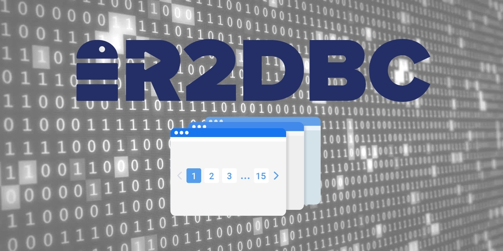

# PREFACE
This Spring Data R2DBC demo project shows how to implement data pagination by leveraging the usefullness of reactive and non-blocking connection. To apply pagination over a result from a method present in a repository we use the [Pageable](https://docs.spring.io/spring-data/commons/docs/current/api/org/springframework/data/domain/Pageable.html) interface as an argument to the method.

<br>

# REQUIREMENT
- Java 11+
- Docker (optional)

<br>

# HOW TO TEST
## Boot up the application
```bash
$ ./mvnw spring-boot:run
```
From the above execution, we are using as the source database the [H2 database](https://www.h2database.com/html/main.html), which is a memory database engine. If you want to test the application with a physical database like PostgreSQL you simply need to go to the [pom.xml](./pom.xml) and replace the r2dbc's H2 dependency by:
```xml
<dependency>
    <groupId>io.r2dbc</groupId>
    <artifactId>r2dbc-postgresql</artifactId>
    <scope>runtime</scope>
</dependency>
```
And then update [application-postgres.properties](./src/main/resources/application-postgres.properties) with the connection details for the PostgreSQL instance (`url`, `username`, `password`). For example, you can use the following docker command to spin up a PostgreSQL instance locally:
```bash
docker run --rm -p 5432:5432 -e POSTGRES_PASSWORD=postgres postgres:14-alpine -d postgres
```
With the PostgreSQL instance up and running, you can update the [application-postgres.properties](./src/main/resources/application-postgres.properties) as follows:
```properties
spring.r2dbc.url=r2dbc:postgresql://localhost:5432/postgres
spring.r2dbc.username=postgres
spring.r2dbc.password=postgres
```

After all those steps, you can start the application as follows:
```bash
$ ./mvnw spring-boot:run -Dspring-boot.run.profiles=postgres
```

<br>

## Request data with pagination
```bash
$ curl -X GET http://localhost:8080/product?page=0&size=5
```

<br>


# BONUS
## How to paginate in a reactive way
If you need to paginate manually a sequence of data, in reactive programming referenced by a [Flux](https://projectreactor.io/docs/core/release/api/reactor/core/publisher/Flux.html) instance, you can do as follows:
```java
var pageRequest = PageRequest.of(page, size);
var fluxData = methodReturningDataAsFlux(pageable);
var result = fluxData.buffer(pageRequest.getPageSize(), (pageRequest.getPageNumber() + 1))
    .elementAt(pageRequest.getPageNumber(), new ArrayList<>())
    .flatMapMany(Flux::fromIterable)
    .collectList()
    .map(t -> new PageImpl<>(t, pageRequest, t.size()));
```
I had to implement in the demo this approach because as of this writing, _the pagination mechanism of Spring Data R2DBC implementation does not work along with native query_. FYI we can use [@Query](https://docs.spring.io/spring-data/r2dbc/docs/current/api/org/springframework/data/r2dbc/repository/Query.html) annotation to specify a SQL statement that will get used when the annotated method gets invoked. <br>
You can check how I did on the method [getAllProducts](./src/main/java/io/davidarchanjo/service/ProductService.java#L22).
